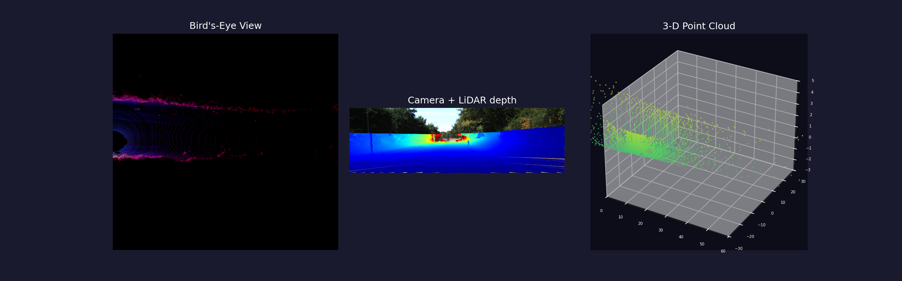

# KITTI LiDAR Viewer

An interactive, three-panel visualiser for the [KITTI Raw Dataset](https://www.cvlibs.net/datasets/kitti/raw_data.php).
Each frame renders simultaneously:

| Panel | Description |
|---|---|
| **Bird's-Eye View** | Top-down 2-D map — red = max height, green = point density, blue = reflectivity intensity |
| **Camera + LiDAR depth** | Colour camera image with every LiDAR point projected on and coloured by distance (blue → red = near → far) |
| **3-D Point Cloud** | Interactive 3-D scatter plot coloured by height (viridis) |



---

## Requirements

| Dependency | Minimum version | Purpose |
|---|---|---|
| Python | 3.12 | type-union syntax (`X \| Y`) |
| numpy | 2.0 | array maths |
| Pillow | 10.0 | image I/O |
| matplotlib | 3.8 | rendering + widgets |
| scipy | 1.11 | (available, used indirectly) |
| vispy | 0.14 | OpenGL backend (optional fallback) |
| pyopengl | 3.1 | vispy dependency |

A **TkAgg** matplotlib backend is used by default. If Tk is not available on your system switch to `Qt5Agg` or `MacOSX` by editing line 30 of [viewer.py](viewer.py).

---

## Setup

```bash
# 1. Clone the repo
git clone <repo-url>
cd KITTI

# 2. Create and activate a virtual environment
python3 -m venv ~/venv/kitti
source ~/venv/kitti/bin/activate      # Windows: .\venv\kitti\Scripts\activate

# 3. Install dependencies
pip install -r requirements.txt
```

---

## Dataset layout

Download a KITTI raw sequence and unzip it so the directory tree matches:

```
/path/to/KITTI/extract/
├── 2011_09_26_calib/
│   └── 2011_09_26/
│       ├── calib_cam_to_cam.txt
│       ├── calib_imu_to_velo.txt
│       └── calib_velo_to_cam.txt
└── 2011_09_26_drive_NNNN_sync/
    └── 2011_09_26/
        └── 2011_09_26_drive_NNNN_sync/
            ├── image_00/data/*.png    ← greyscale left
            ├── image_01/data/*.png    ← greyscale right
            ├── image_02/data/*.png    ← colour left   (default)
            ├── image_03/data/*.png    ← colour right
            ├── oxts/data/*.txt
            └── velodyne_points/data/*.bin
```

The viewer defaults to the sequence at:
```
~/Datasets/KITTI/extract/2011_09_26_drive_0019_sync/
```
Override via `--drive` and `--calib` flags (see below).

---

## Usage

```bash
# Default sequence, colour-left camera (cam 2), start at frame 0
python viewer.py

# Custom sequence
python viewer.py \
  --drive /path/to/extract/2011_09_26_drive_0035_sync/2011_09_26/2011_09_26_drive_0035_sync \
  --calib /path/to/extract/2011_09_26_calib/2011_09_26 \
  --cam 2 \
  --start 50
```

### CLI flags

| Flag | Default | Description |
|---|---|---|
| `--drive` | hard-coded path | Path to the sync drive directory (contains `velodyne_points/`, `image_0X/`) |
| `--calib` | hard-coded path | Path to the calibration directory (contains `calib_*.txt`) |
| `--cam` | `2` | Camera index: `0` grey-left, `1` grey-right, `2` colour-left, `3` colour-right |
| `--start` | `0` | Frame index to start at |

### Keyboard controls

| Key | Action |
|---|---|
| `n` or `→` | Next frame |
| `p` or `←` | Previous frame |
| `s` | Save current view as `kitti_frame_NNNN.png` |
| `q` or `Esc` | Quit |

The slider at the bottom can also be dragged to jump to any frame directly.

---

## Project structure

```
KITTI/
├── kitti/
│   ├── __init__.py          — public API re-exports
│   ├── calibration.py       — parse calib_*.txt, build projection matrices
│   ├── lidar.py             — load .bin scans, project LiDAR → image pixels
│   └── bev.py               — render bird's-eye view RGB image
├── viewer.py                — interactive matplotlib viewer (entry point)
├── requirements.txt
├── CONTRIBUTING.md
├── CHANGELOG.md
└── README.md
```

### `kitti` package API

```python
from kitti import build_projection_matrix, load_velo_scan, velo_to_image, make_bev

# Calibration
P, velo_to_rect = build_projection_matrix(calib_dir, cam=2)
# P            : (3, 4) projection matrix  →  image pixels
# velo_to_rect : (4, 4) velodyne → rectified camera frame

# LiDAR
pts = load_velo_scan("0000000000.bin")        # (N, 4): x, y, z, intensity
uv, depth = velo_to_image(pts, P, velo_to_rect, img_shape=(375, 1242))
# uv    : (M, 2) pixel coordinates inside the image
# depth : (M,)  distance in metres for each projected point

# Bird's-eye view
bev = make_bev(pts, x_range=(0, 70), y_range=(-40, 40), resolution=0.1)
# bev : (H, W, 3) uint8 RGB image
```

---

## Coordinate system

KITTI uses a right-handed coordinate system measured from the IMU/GPS origin:

```
        z (up)
        |
        |
        +------→ x (forward)
       /
      y (left)
```

The Velodyne HDL-64E spins around the z axis and returns `(x, y, z, intensity)` per point. Calibration files provide the rigid-body transforms needed to convert LiDAR coordinates into each camera's rectified image plane.

---

## Troubleshooting

**`No module named 'tkinter'`** — install Tk: `sudo apt install python3-tk` (Debian/Ubuntu) or switch the backend in [viewer.py:30](viewer.py#L30) to `Qt5Agg`.

**Black BEV image** — the point cloud range parameters may not match your sequence. Adjust `x_range` and `y_range` in [kitti/bev.py](kitti/bev.py#L4).

**Slow frame transitions** — the 3-D scatter is subsampled to 5,000 points. Lower this limit on line 209 of [viewer.py](viewer.py#L209) for faster rendering.

**`ValueError: could not convert string to float`** in calibration — a new field was added to the calib file. The parser in [kitti/calibration.py](kitti/calibration.py) silently skips non-numeric lines; this is expected behaviour.

---

## License

This project is released under the MIT License. The KITTI dataset itself is subject to its own [license agreement](https://www.cvlibs.net/datasets/kitti/index.php); it is not redistributed here.
